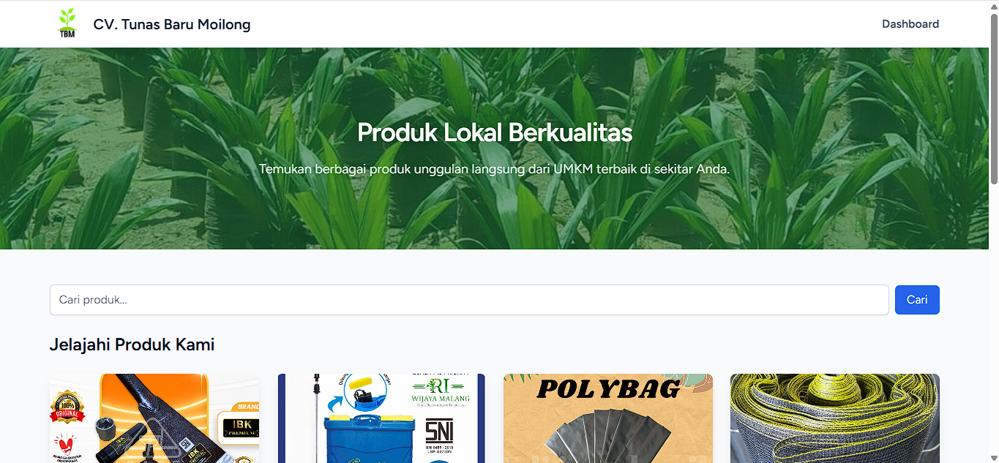
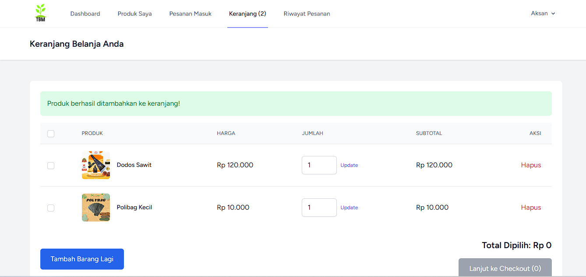
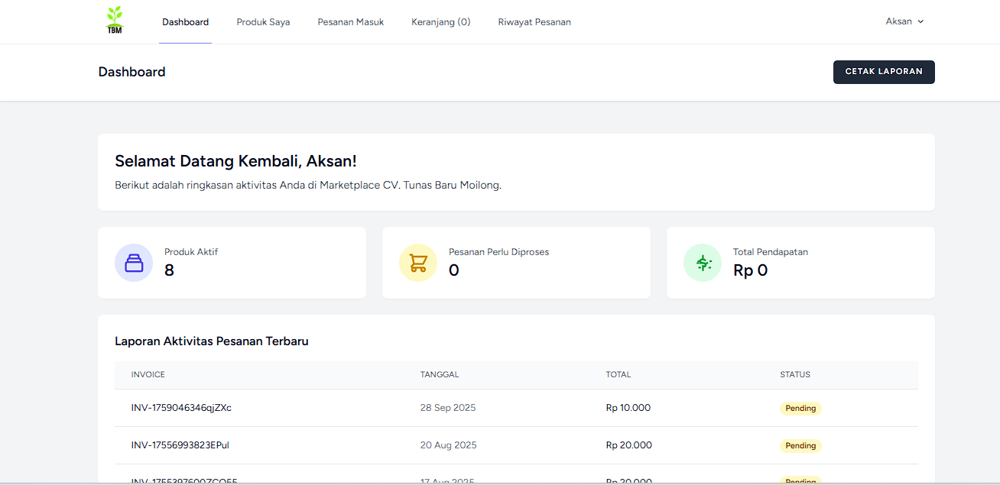

# Marketplace UMKM CV. Tunas Baru Moilong

<p align="center">
    <a href="https://laravel.com" target="_blank">
        
    </a>
</p>

<p align="center">
Sebuah platform e-commerce yang dirancang untuk membantu para pelaku Usaha Mikro, Kecil, dan Menengah (UMKM) dalam memasarkan produk-produk mereka secara online. Dibangun menggunakan Laravel & Tailwind CSS.
</p>

<p align="center">
<a href="https://github.com/laravel/framework/actions"></a>
<a href="https://packagist.org/packages/laravel/framework"></a>
<a href="https://packagist.org/packages/laravel/framework"></a>
<a href="https://packagist.org/packages/laravel/framework"></a>
</p>

---

## ✨ Tentang Proyek

Proyek ini bertujuan untuk menyediakan sebuah platform digital yang mudah digunakan bagi para penjual (UMKM) untuk mengelola produk mereka dan bagi pembeli untuk menemukan dan membeli produk-produk lokal berkualitas. Dengan adanya tiga peran pengguna (pembeli, penjual, dan admin), platform ini memastikan manajemen yang terstruktur dan efisien.

---

## 📸 Tampilan Aplikasi

Berikut adalah beberapa cuplikan tampilan dari Marketplace UMKM:

| Halaman Beranda                                  | Keranjang Belanja                                  | Dashboard Penjual                                  |
| :----------------------------------------------: | :------------------------------------------------: | :------------------------------------------------: |
|  |  |  |

*(**Catatan Penting:** Ganti `nama_screenshot_beranda.png`, `nama_screenshot_keranjang.png`, dan `nama_screenshot_dashboard.png` dengan **nama file gambar Anda yang sebenarnya** yang ada di folder `public/images`.)*

---

## 🚀 Fitur Utama

-   **🔐 Autentikasi Pengguna**: Sistem registrasi dan login yang aman.
-   **👤 Manajemen Profil**: Update info profil dan kata sandi.
-   **🧑‍🤝‍🧑 Peran Pengguna**:
    -   **Pembeli**: Jelajahi produk, keranjang, checkout, riwayat pesanan.
    -   **Penjual**: Kelola produk (CRUD), lihat pesanan masuk.
    -   **Admin**: Kelola semua pesanan, pantau platform.
-   **📦 Manajemen Produk**: Dashboard intuitif untuk penjual.
-   **🛒 Keranjang Belanja**: Fungsionalitas keranjang lengkap.
-   **💳 Proses Checkout**: Alur checkout yang sederhana.
-   **📊 Riwayat Pesanan**: Lihat detail dan status pesanan.
-   **📱 Desain Responsif**: Optimal di desktop dan mobile.

---

## 🛠️ Dibangun Dengan

-   [Laravel](https://laravel.com/)
-   [Tailwind CSS](https://tailwindcss.com/)
-   [Alpine.js](https://alpinejs.dev/)
-   [MySQL](https://www.mysql.com/)
-   [Vite](https://vitejs.dev/)

---

## 🏁 Memulai

Untuk menjalankan proyek ini di lingkungan lokal Anda:

### Prasyarat

-   PHP >= 8.2
-   Composer
-   Node.js & NPM
-   Database (misalnya MySQL)

### Instalasi

1.  **Clone repositori:**
    ```sh
    git clone [https://github.com/aksan-12/marketplace-umkm.git](https://github.com/aksan-12/marketplace-umkm.git)
    cd marketplace-umkm
    ```
2.  **Instal dependensi PHP:**
    ```sh
    composer install
    ```
3.  **Instal dependensi Node.js:**
    ```sh
    npm install
    ```
4.  **Buat file `.env`:**
    Salin `.env.example` menjadi `.env` dan sesuaikan konfigurasi database.
    ```sh
    cp .env.example .env
    ```
5.  **Generate kunci aplikasi:**
    ```sh
    php artisan key:generate
    ```
6.  **Jalankan migrasi database:**
    ```sh
    php artisan migrate
    ```
7.  **Compile aset frontend & jalankan server:**
    ```sh
    npm run dev
    ```
    Di terminal lain:
    ```sh
    php artisan serve
    ```

---

## 📄 Lisensi

Didistribusikan di bawah Lisensi MIT. Lihat `LICENSE` untuk informasi lebih lanjut.

---

## 📞 Kontak

Aksan - [Linkedin](https://www.linkedin.com/in/aksan-null-7834a3311/)

Project Link: [https://github.com/aksan-12/marketplace-umkm](https://github.com/aksan-12/marketplace-umkm)
